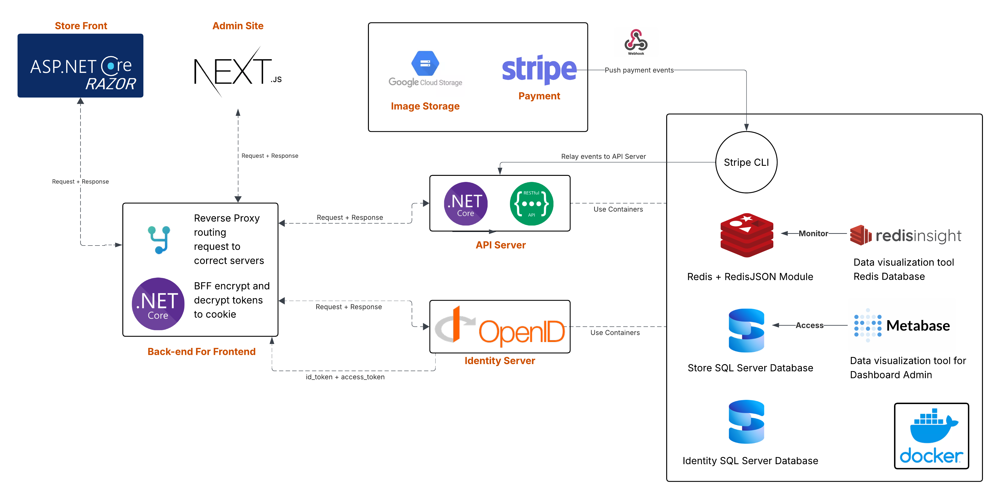
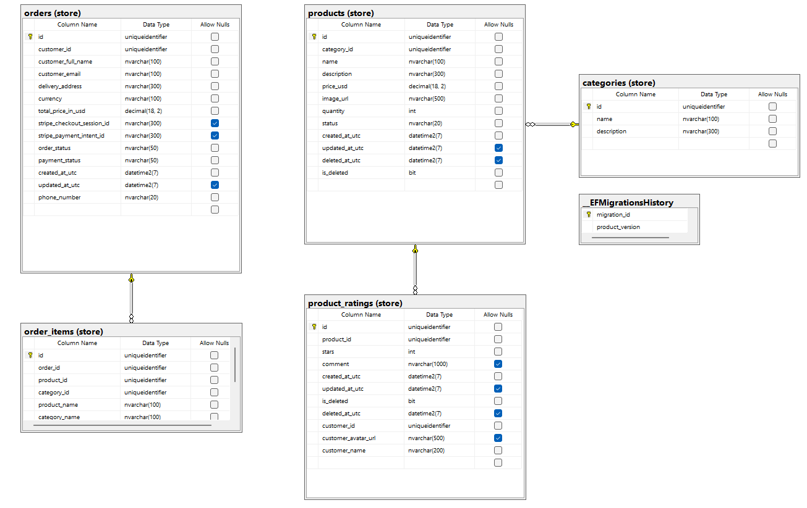
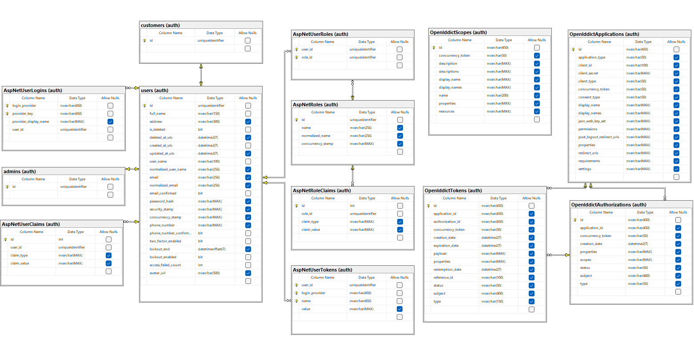

# Nash Friday Shop (R2E Training Bootcamp)


## Techstack

- **Backend**: .NET 10 (ASP.NET Core Web Api, Entity Framework Core, FluentValidation)
- **Frontend**: Next.js (Admin Site), ASP.NET Razor Pages (StoreFront), HTMX
- **BFF**: OIDC client, YARP Reverse Proxy, Cookie-based authentication
- **Identity**: OpenIddict, Authorization Code Flow + PKCE
- **Database**: SQL Server
- **Architecture**: Vertical Slice Architecture
- **Testing**: xUnit, Coverlet
- **Tooling**: Directory.Packages.props, Directory.Build.props, docker-compose.yaml
- **API Docs**: Scalar
- **Dashboard**: Metabase
- **Payment**: Stripe
- **Cart**: Redis, RedisInsight

## Project Scope & Features

For customers:

- Home page: category menu, features products
- View products by category
- View product details
- Product rating:
  - Test: Classic Denim Yacket
  - Extra:
    - View ratings
    - Post rating + comment (1 loggedin account can do it only one)
- Register
- Login/Logout
- Optional (shopping cart, ordering, IdentityServer)
- Extra:
  - New Product (created date < 7)
  - Payment
  - Order Refund: demo order refund via stripe
  - Order Delivered

For admin:

- Login/logout
- Manage product categories (Name, Description): CRU
- Manage products (Name, Category, Description, Price, Images, CreatedDate, UpdatedDate): CRUD
- View customers: R
- Extra:
  - Order Mangement: Get All, View, delivery (signalR – Server Send End)
  - Dashboard
  - Export PDF Dashboard
    - Top 10 products having highest average rating
    - Top 10 products purchased the most
    - Top 10 customer spending the most money on the products
    
Test:
- Unit Testing
- Extra:
  - Integration Testing
  - Performance Testing

API Documentation

Extra Flows:
- CI on FE, CI on BE
- Google Cloud Storage
- Stripe
- Metabase
- Redis Insight

## Current Supporting APIs

| Layer               | Endpoint                                 | Method   | Description                                             | Status                | Tests     |
| ------------------- | ---------------------------------------- | -------- | ------------------------------------------------------- | --------------------- | --------- |
| **Public API**      | `/api/all/categories`                    | GET      | List all categories                                     | ✅ Completed          | ✅ UT, IT |
| **Public API**      | `/api/all/categories/{id}`               | GET      | Category details                                        | ✅ Completed          | ✅ UT, IT |
| **Public API**      | `/api/all/products`                      | GET      | Product listing, filters, pagination                    | ✅ Completed          | ✅ UT, IT |
| **Public API**      | `/api/all/products/{id}`                 | GET      | Product details                                         | ✅ Completed          | ✅ UT, IT |
| **Public API**      | `/api/all/products/{id}/ratings`         | GET      | Product ratings list                                    | ✅ Completed          | ✅ UT, IT |
| **Customer API**    | `/api/customer/products/{id}/rating`     | POST     | Add product rating/comment                              | ✅ Completed          | ✅ UT, IT |
| **Customer API**    | `/api/customer/cart`                     | GET      | Get current user cart                                   | ✅ Completed          | ✅ UT     |
| **Customer API**    | `/api/customer/cart`                     | POST     | Create or add item to cart or update product's quantity | ✅ Completed          | ✅ UT     |
| **Customer API**    | `/api/customer/orders/checkout`          | POST     | Create Stripe checkout session for current cart         | ✅ Completed          | ✅ UT     |
| **Customer API**    | `/api/customer/orders/webhook`           | POST     | Handle Stripe Webhook (Checkout completed)              | ✅ Completed          | ✅ UT     |
| **Admin API**       | `/api/admin/products`                    | GET/POST | List products / Create product                          | ✅ Completed          | ✅ UT, IT |
| **Admin API**       | `/api/admin/products/{id}`               | GET/PUT  | Product details / Update product                        | ✅ Completed          | ✅ UT, IT |
| **Admin API**       | `/api/admin/products/{id}/toggle-delete` | POST     | Soft delete (toggle) product                            | ✅ Completed          | ✅ UT, IT |
| **Admin API**       | `/api/admin/products/{id}/image`         | POST     | Update product image                                    | ✅ Completed          | ✅ UT, IT |
| **Admin API**       | `/api/admin/categories`                  | GET/POST | List categories / Create category                       | ✅ Completed          | ✅ UT, IT |
| **Admin API**       | `/api/admin/categories/{id}`             | GET/PUT  | Category details / Update category                      | ✅ Completed          | ✅ UT, IT |
| **Admin API**       | `/api/admin/orders`                      | GET      | Order listing (Paginated & Searchable)                  | ✅ Completed          | ✅ UT, IT |
| **Admin API**       | `/api/admin/orders/{id}`                 | GET      | Order details                                           | ✅ Completed          | ✅ UT, IT |
| **Identity Admin**  | `/api/admin/customers`                   | GET      | Customer listing (Paginated & Searchable)               | ✅ Completed          | ❌ None   |
| **Identity Server** | `/connect/authorize`                     | GET      | Start OIDC authorization code flow                      | ✅ Completed          | ❌ None   |
| **Identity Server** | `/connect/token`                         | POST     | Exchange auth code → tokens                             | ✅ Completed          | ❌ None   |
| **Identity Server** | `/connect/logout`                        | POST     | Identity logout flow                                    | ✅ Completed          | ❌ None   |
| **BFF**             | `/api/auth/login`                        | GET      | Start login from React → IdentityServer                 | ✅ Completed          | ❌ None   |
| **BFF**             | `/api/auth/me`                           | GET      | Get current user info & claims                          | ✅ Completed          | ❌ None   |
| **BFF**             | `/api/auth/logout`                       | POST     | Logout BFF session + Identity session                   | ✅ Completed          | ❌ None   |
| **BFF**             | `/api/auth/register`                     | GET      | Redirect to IdentityServer registration                 | ✅ Completed          | ❌ None   |
| **BFF**             | `/signin-oidc`                           | GET      | OIDC callback endpoint (middleware handled)             | ✅ Middleware handled | ❌ None   |
| **BFF**             | `/dev/auth/tokens`(Dev Only)             | GET      | Return access_token, id_token, refresh_token            | ✅ Completed          | ❌ None   |
| **BFF**             | `/api/{**catch-all}`                     | ALL      | Reverse proxy Customer-site + Admin-site requests → API | ✅ Completed          | ❌ None   |

## Current Supporting Pages In Admin, Customer and Identity Server

| Layer               | Endpoint                 | Method   | Description                    | Status       |
| ------------------- | ------------------------ | -------- | ------------------------------ | ------------ |
| **Admin Site**      | `/dashboard`             | GET      | Admin overview & statistics    | ✅ Completed |
| **Admin Site**      | `/products`              | GET      | Product management list        | ✅ Completed |
| **Admin Site**      | `/products/new`          | GET      | Create new product page        | ✅ Completed |
| **Admin Site**      | `/products/[id]`         | GET      | Edit product details page      | ✅ Completed |
| **Admin Site**      | `/categories`            | GET      | Category management list       | ✅ Completed |
| **Admin Site**      | `/categories/new`        | GET      | Create new category page       | ✅ Completed |
| **Admin Site**      | `/categories/[id]`       | GET      | Edit category details page     | ✅ Completed |
| **Admin Site**      | `/customers`             | GET      | Customer management list       | ✅ Completed |
| **Admin Site**      | `/orders`                | GET      | Order management list          | ✅ Completed |
| **Admin Site**      | `/orders/[id]`           | GET      | Order details page             | ✅ Completed |
| **Admin Site**      | `[...slug]`              | ALL      | Global 404 Routing             | ✅ Completed |
| **StoreFront**      | `/`                      | GET      | Home Page (Top Rated Products) | ✅ Completed |
| **StoreFront**      | `/Products`              | GET      | Product Search & Filter Page   | ✅ Completed |
| **StoreFront**      | `/Products/Details/{id}` | GET      | Product Details Page           | ✅ Completed |
| **StoreFront**      | `/Cart`                  | GET      | Shopping Cart Page             | ✅ Completed |
| **StoreFront**      | `/Orders`                | GET      | My Orders History Page         | ✅ Completed |
| **StoreFront**      | `/Profile`               | GET      | User Profile & Account Details | ✅ Completed |
| **StoreFront**      | `/Checkout`              | GET/POST | Checkout Page (Form + Summary) | ✅ Completed |
| **StoreFront**      | `/Checkout/Success`      | GET      | Order Success Confirmation     | ✅ Completed |
| **StoreFront**      | `/Errors/{code}`         | GET      | Global Error Pages (404, 500)  | ✅ Completed |
| **Identity Server** | `/Account/Login`         | GET      | Render Razor login page        | ✅ Completed |
| **Identity Server** | `/Account/Login`         | POST     | Submit login credentials       | ✅ Completed |
| **Identity Server** | `/Account/Register`      | GET      | Render registration page       | ✅ Completed |
| **Identity Server** | `/Account/Register`      | POST     | Submit registration form       | ✅ Completed |

## Architecture



## ERD (V1)

### Store Domain



### Identity Domain



## BFF + Reverse Proxy, Identity Server, API Server, Frontends communications


## Running the Project

To get the NashFriday Store ecosystem running locally, follow these steps:

1. **Docker Infrastructure**: Start the required infrastructure services using Docker Compose:
   ```bash
   docker-compose up -d
   ```
2. **Secrets Configuration**: Ensure you have the `.secret` folder containing the necessary encryption keys and sensitive configurations. This folder must be placed in the same directory as the `docker-compose.yaml` file.
   > [!IMPORTANT]
   > Contact the project owner to obtain the `.secret` folder and the necessary values for your `appsettings.json` files if you are missing them.
3. **Backend Services**: Run all four .NET API projects using `dotnet watch` for hot-reloading:
   - `NashFridayStore.API`
   - `NashFridayStore.BFF`
   - `NashFridayStore.IdentityServer`
   - `NashFridayStore.StoreFront` (Razor Pages)
4. **Admin Dashboard**: Navigate to the `src/admin-site` directory and start the development server:
   ```bash
   npm run dev
   ```
5. **Monitoring**: Open **Redis Insight** to monitor the cart sessions and caching layers in real-time.

## Project Structure

```
src/
├── NashFridayStore.API/              # Endpoints, Validations, Handlers, Exceptions
├── NashFridayStore.Domain/           # Domain entities
├── NashFridayStore.Infrastructure/   # Data access, configurations, migrations
├── NashFridayStore.BFF/              # Storing Tokens, Reverse Proxy
├── NashFridayStore.IdentityServer/   # Auth, Authz service
├── NashFridayStore.StoreFront/       # Frontend Customer-site
├── admin-site/                       # Frontend Admin-site
└── tests/                            # Unit and integration tests
```

## Vertical Slice Architecture Explanation

Each feature is organized in its own "slice" within the **API** project with all related business logic together:

- **Request**: Request contract object
- **Response**: Response contract returned by the handler
- **Handler**: Core business logic and domain operations
- **Validator**: FluentValidation rules for requests
- **Exceptions**: Custom exceptions for the feature
- **Endpoint**: THe API Endpoint based on Controller

Example from `src/NashFridayStore.API/Features/Products/GetProduct/`:

**Request.cs**:

```csharp
public sealed record Request(Guid Id);
```

**Response.cs**:

```csharp
public sealed record Response(Guid Id, string Name, string ImageUrl, decimal PriceUsd, ProductStatus Status);
```

**Validator.cs**:

```csharp
public sealed class Validator : AbstractValidator<Request>
{
    public Validator()
    {
        RuleFor(x => x.Id)
            .NotEmpty()
            .WithMessage("Product Id is required.");
    }
}
```

**Handler.cs**:

```csharp
public sealed class Handler(StoreDbContext dbContext, IValidator<Request> validator)
{
    public async Task<Response> HandleAsync(Request req, CancellationToken ct)
    {
        ValidationResult validation = await validator.ValidateAsync(req, ct);
        if (!validation.IsValid)
        {
            throw Exceptions.Validation(validation.Errors);
        }

        Response? product = await dbContext.Products
            .AsNoTracking()
            .Where(x => x.Id == req.Id)
            .Select(x => new Response(x.Id, x.Name, x.ImageUrl, x.PriceUsd, x.Status))
            .FirstOrDefaultAsync(ct);

        if (product is null)
        {
            throw Exceptions.NotFound(req.Id);
        }

        return product;
    }
}
```

**Exceptions.cs**:

```csharp
internal static class Exceptions
{
    internal static RequestValidationException Validation(IList<ValidationFailure> errors)
    {
        return new RequestValidationException(
            errors.Select(e => new RequestValidationError(e.PropertyName, e.ErrorMessage)));
    }

    internal static ApiResponseException NotFound(Guid id)
    {
        return new ApiResponseException(new ProblemDetails
        {
            Status = StatusCodes.Status404NotFound,
            Title = "Product not found.",
            Detail = $"Product with id '{id}' was not found.",
            Type = "https://datatracker.ietf.org/doc/html/rfc7231#section-6.5.4"
        });
    }
}
```

**Endpoint.cs**:

```csharp
using NashFridayStore.API.Features.Products.GetProduct;

[ApiController]
[Route("api/products/{id:guid}")]
public sealed class GetProductEndpoint(Handler handler) : ControllerBase
{
    [HttpGet]
    public async Task<IActionResult> Get([FromRoute] Guid id, CancellationToken ct)
    {
        var request = new Request(id);
        Response response = await handler.HandleAsync(request, ct);
        return Ok(response);
    }
}
```

**Unit Test**:

```csharp
[Fact]
[Trait("UT", "Id")]
public void Validate_IdIsEmpty_ShouldHaveValidationError()
{
    // Arrange
    var request = new Request(Guid.Empty);

    // Act
    TestValidationResult<Request> result = _validator.TestValidate(request);

    // Assert
    Assert.False(result.IsValid);
    ValidationFailure error = Assert.Single(result.Errors);
    Assert.Equal(nameof(Request.Id), error.PropertyName);
    Assert.Equal(Validator.IdRequired, error.ErrorMessage);
}
```

**Integration Test**:

```csharp
[Fact]
public async Task GetProduct_ById_ShouldReturnProduct()
{
    // Arrange
    CancellationToken cancellationToken = TestContext.Current.CancellationToken;
    Category category = new CategoryBuilder().Build();

    Product product = new ProductBuilder()
        .WithCategoryId(category.Id)
        .WithName("Laptop")
        .Build();

    _dbContext.Categories.Add(category);
    _dbContext.Products.Add(product);
    await _dbContext.SaveChangesAsync(cancellationToken);

    // Act
    HttpResponseMessage response = await _client.GetAsync($"/api/products/{product.Id}", cancellationToken);

    // Assert
    response.EnsureSuccessStatusCode();
    Response? result = await response.Content.ReadFromJsonAsync<Response>(cancellationToken: cancellationToken);

    Assert.NotNull(result);
    Assert.Equal(product.Id, result!.Id);
    Assert.Equal("Laptop", result.Name);
    Assert.Equal(product.PriceUsd, result.PriceUsd);
    Assert.Equal(product.Status, result.Status);
}
```

## Design Patterns Applied

- **Options Pattern**: config via `IOptions<T>`
- **Dependency Injection**: register services and handlers
- **Builder Pattern**: test and seed helpers
- **Vertical Slice Architecture**: feature-based structure

## Reference Links

### 🌐 Frontend Stack & CI/CD

- **React CI/CD**: [GitHub Actions for React](https://santhosh-adiga-u.medium.com/setting-up-a-complete-ci-cd-pipeline-for-react-using-github-actions-9a07613ceded)
- **Deployment**: [Vercel](https://vercel.com)
- **Testing**: [Jest (Unit/Integration)](https://jestjs.io/), [Cypress (E2E)](https://www.cypress.io/)

### 🛡️ htmx & UI

- **htmx Guide**: [htmx for ASP.NET Developers](https://aspnet-htmx.com/chapter05/)
- **hx-trigger**: [Custom Event Triggers](https://htmx.org/headers/hx-trigger/)
- **htmx Deep Dive**: [Chapter 08 - Triggers](https://aspnet-htmx.com/chapter08/)
- **UI Frameworks**: [daisyUI](https://daisyui.com), [tailwindcss](https://tailwindcss.com)

### 🧩 ASP.NET Core Razor Pages

- **ViewComponents**: [Reusable UI logic](https://learn.microsoft.com/en-us/aspnet/core/mvc/views/view-components)
- **Tag Helpers**: [Native HTML enhancements](https://learn.microsoft.com/en-us/aspnet/core/mvc/views/tag-helpers/intro)
- **Middleware**: [Request Pipeline & Delegates](https://medium.com/@Sina-Riyahi/understanding-request-delegates-and-middleware-in-asp-net-core-5f9b22d16613)
- **Official Middleware Docs**: [ASP.NET Core Middleware](https://learn.microsoft.com/en-us/aspnet/core/fundamentals/middleware/?view=aspnetcore-10.0)
- **Request Storage**: [HttpContext.Items (Request Scope)](https://learn.microsoft.com/en-us/dotnet/api/microsoft.aspnetcore.http.httpcontext.items)

### 🏗️ Architecture & Backend

- **Vertical Slice Architecture**: [The Jimmy Bogard Pattern](https://nadirbad.dev/vertical-slice-architecture-dotnet)
- **Modern Exception Handling**: [Global Error Handling in .NET 8+](https://www.milanjovanovic.tech/blog/global-error-handling-in-aspnetcore-8)
- **ProblemDetails**: [RFC 7807 Implementation](https://medium.com/@aseem2372005/handling-api-errors-the-right-way-understanding-problemdetails-in-asp-net-core-web-api-e3f7d404672c)
- **DbContext Pooling**: [Efficiency at scale](https://medium.com/@razeshmsb02/adddbcontext-vs-adddbcontextpool-vs-adddbcontextfactory-3760857737d1)
- **HATEOAS**: [Self-Discoverable APIs](https://dev.to/wallacefreitas/supercharge-your-rest-apis-with-hateoas-the-key-to-smarter-self-discoverable-endpoints-5dg3)
- **Delegating Handlers**: [Extending HttpClient](https://www.milanjovanovic.tech/blog/extending-httpclient-with-delegating-handlers-in-aspnetcore)

### 🔐 Identity & Security

- **BFF Pattern**: [Backend For Frontend (Auth0)](https://auth0.com/blog/the-backend-for-frontend-pattern-bff/)
- **IdentityServer**: [Duende Big Picture](https://docs.duendesoftware.com/identityserver/overview/big-picture/)
- **OpenIddict**: [Auth Code Flow + PKCE](https://dev.to/naeemsahil/implementing-openid-connect-with-openiddict-4fmp)
- **Client Credentials**: [Setting up OpenIddict Client Credentials](https://dev.to/robinvanderknaap/setting-up-an-authorization-server-with-openiddict-part-iii-client-credentials-flow-55lp)
- **PAR Configuration**: [Pushed Authorization Requests](https://documentation.openiddict.com/configuration/pushed-authorization-requests)
- **OIDC Claims**: [ID Token Standard](https://openid.net/specs/openid-connect-core-1_0.html#IDToken)
- **OAuth 2.0 Spec**: [RFC 6749 Section 1.1](https://datatracker.ietf.org/doc/html/rfc6749#section-1.1)
- **JWT Auth**: [Configure Bearer Auth](https://learn.microsoft.com/en-us/aspnet/core/security/authentication/configure-jwt-bearer-authentication)

### 🎪 Payment & Webhooks

- **Stripe CLI**: [Local Webhook Testing](https://stripe.com/docs/stripe-cli)
- **Docker Compose**: [Stripe CLI + Docker (Martin Bean)](https://martinbean.dev/blog/2025/08/15/using-the-stripe-cli-with-docker-compose/)
- **Signature Verification**: [Security Best Practices](https://stripe.com/docs/webhooks/signatures)
- **Testing**: [Stripe Testing Guide](https://docs.stripe.com/testing)
- **Event Lifecycle**: [Stripe Event Types](https://docs.stripe.com/api/events/types)

### 🗄️ Database & Storage

- **SQL Server**: [Official Docker Image](https://hub.docker.com/r/microsoft/mssql-server)
- **Inheritance Mapping**: [TPH, TPT, TPC Patterns](https://medium.com/@sematopcu/inheritance-mapping-in-databases-tph-tpt-tpc-fc175c572880)
- **Cloud Storage**: [Google Cloud Storage Buckets](https://docs.cloud.google.com/storage/docs/creating-buckets)
- **Auth Storage**: [Application Default Credentials (ADC)](https://docs.cloud.google.com/docs/authentication/application-default-credentials)

### 🧪 Testing

- **Integration Tests**: [ASP.NET Core Guide](https://learn.microsoft.com/en-us/aspnet/core/test/integration-tests)
- **In-Memory DBs**: [SQLite In-Memory Pros/Cons](https://learn.microsoft.com/en-us/dotnet/standard/data/sqlite/in-memory-databases)
- **Serial Execution**: [Forcing serial tests in xUnit](https://stackoverflow.com/questions/1408175/execute-unit-tests-serially-rather-than-in-parallel)
- **Coverage Separation**: [Codecov Flags Documentation](https://docs.codecov.com/docs/flags)

### 🛠️ Tooling & Infrastructure

- **Reverse Proxy**: [YARP (Yet Another Reverse Proxy)](https://github.com/dotnet/yarp)
- **YARP Overview**: [Microsoft YARP Docs](https://learn.microsoft.com/en-us/aspnet/core/fundamentals/servers/yarp/yarp-overview?view=aspnetcore-10.0)
- **OpenAPI Customization**: [Customize OpenAPI in .NET](https://learn.microsoft.com/en-us/aspnet/core/fundamentals/openapi/customize-openapi?view=aspnetcore-10.0)
- **Scalar JWT**: [JWT Support in Scalar](https://stackoverflow.com/questions/79265776/how-to-add-jwt-token-support-globally-in-scalar-for-a-net-9-application)
- **Redis Insight**: [Docker Setup for Redis Visualization](https://medium.com/@mahmud.ibrahim021/set-up-redis-with-redisinsight-using-docker-for-local-development-64b0c2aad4a7)
- **ERD**: [LucidChart Diagram](https://lucid.app/lucidchart/80f9e014-52b0-4936-90e0-51cf2d40980b/edit)

## Contribution

1. Create feature branch from `develop`
2. Follow vertical slice pattern
3. Add tests for new features
4. Submit PR for review

## Copyright

© 2026 Nashtech. All rights reserved.


