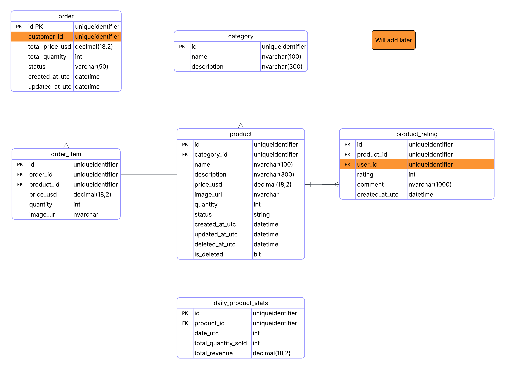

# Nash Friday Shop


## Techstack

- **🔧 Backend**: .NET 10 (ASP.NET Core Web Api, Entity Framework Core, FluentValidation)
- **🌐 Frontend**: Next.js (Admin Site), ASP.NET Razor Pages (StoreFront)
- **🧩 BFF**: Backend for Frontend service
- **🔐 Identity**: `(Updating)`
- **🗄️ Database**: SQL Server
- **🏗️ Architecture**: Vertical Slice Architecture
- **🧪 Testing**: xUnit, Coverlet
- **🛠️ Tooling**: `Directory.Packages.props`, `Directory.Build.props`, `docker-compose.yaml`
- **🎪 Payment**: `Stripe`
- **🛒 Cart**: `Redis`

## Current Supporting APIs for Admin only

| API Endpoint                       | Method | Description                           | Status             |
| ---------------------------------- | ------ | ------------------------------------- | ------------------ |
| `/api/admin/categories`            | GET    | Category menu / list categories       | ✅ Completed       |
| `/api/admin/categories/{id}`       | GET    | Category details                      | ✅ Completed       |
| `/api/admin/products`              | GET    | Product listing, filters, pagination  | ✅ Completed       |
| `/api/admin/products/{id}`         | GET    | Product details                       | ✅ Completed       |
| `/api/admin/products/{id}`         | POST   | Create a product                      | ✅ Completed       |
| `/api/admin/products/{id}`         | PUT    | Update a product                      | ✅ Completed       |
| `/api/admin/products/{id}`         | DELETE | Soft Delete a product                 | ✅ Completed       |
| `/api/admin/products/{id}/ratings` | GET    | Rating listing, filters, pagination   | ✅ Completed       |
| `/api/admin/products/{id}/rating`  | POST   | Add rating and comment to a product   | ✅ Completed       |
| `/api/admin/orders`                | GET    | Order listing, filters, pagination    | ❌ Not implemented |
| `/api/admin/customers`             | GET    | Customer listing, filters, pagination | ❌ Not implemented |
| `/api/admin/customers/{id}`        | DELETE | Disable customer account              | ❌ Not implemented |

## Current Supporting Pages for Customer only

| Page Route         | Description                                  | Status             |
| ------------------ | -------------------------------------------- | ------------------ |
| `/`                | Home (categories + featured products)        | ❌ Not implemented |
| `/categories`      | List categories                              | ❌ Not implemented |
| `/categories/{id}` | Category details (products by category)      | ❌ Not implemented |
| `/products`        | Product listing (filter/search) + avg rating | ❌ Not implemented |
| `/products/{id}`   | Product details + ratings + comments         | ❌ Not implemented |
| `/cart`            | View cart                                    | ❌ Not implemented |
| `/checkout`        | Checkout                                     | ❌ Not implemented |
| `/orders`          | Order listing                                | ❌ Not implemented |
| `/orders/{id}`     | Order details                                | ❌ Not implemented |
| `/auth/register`   | Customer registration                        | ❌ Not implemented |
| `/auth/login`      | Customer login                               | ❌ Not implemented |
| `/auth/logout`     | Customer logout                              | ❌ Not implemented |

## ERD (V1)



## Week 1 Summary

### Setup FE + BE Source Code

- 3rd Softwares: fork, Postman, VSCode, Docker Desktop, SSMT,
- Dev environment: `secrets`, `appsettings.Development.json`, `IOptions`
- Coding convention: `.editorconfig`
- Central package management: `Directory.Packages.props`
- Central project setting: `Directory.Build.props`
- Code analysis: `SonarAnalyzer`
- DbContext setup, Migrations and seed data preparation: `Product`, `Category`, `ProductRating`
- CORS configuration
- Code coverage setup
- HTTPS support: `dotnet dev-certs`, `Next.js dev cert`
- API Documentation tool: `Scalar`
- Testing stack: `xUnit`, `SQLite In-Memory`, `WebApplicationFactory`
- Exception handler: API exception, validation exception, general exception handler
- API versioning
- Razor Pages store front scaffold
- BFF service scaffold
- Identity Server scaffold
- Next.js admin site scaffold

### CI/CD and Services

- CI: Next.JS CI
- CI: .NET Projects CI
- CD: (later)
- Docker Compose for images: Redis, SQL Server, Redis Insight

### Research

- Identity Server research
- BFF research
- Vertical Slice Architecture research

## Project Structure

```
src/
├── NashFridayStore.API/            # Endpoints
├── NashFridayStore.Domain/         # Domain entities
├── NashFridayStore.Infrastructure/ # Data access, configurations, migrations
├── NashFridayStore.SharedFeatures/ # Business logic handlers, validators, requests/responses
├── NashFridayStore.BFF/            # Backend for Frontend service
├── NashFridayStore.IdentityServer/ # Auth, Authz service
├── NashFridayStore.StoreFront/     # Frontend Customer-site
├── admin-site/                     # Frontend Admin-site
└── tests/                          # Unit and integration tests
```

## Vertical Slice Architecture Explanation

Each feature is organized in its own "slice" within the **SharedFeatures** project with all related business logic together:

- **Request**: Request contract object
- **Response**: Response contract returned by the handler
- **Handler**: Core business logic and domain operations
- **Validator**: FluentValidation rules for requests
- **Exceptions**: Custom exceptions for the feature

The **API** project contains thin endpoint controllers that only route requests to handlers.

Example from `src/NashFridayStore.SharedFeatures/Features/Products/GetProduct/`:

**Request.cs**:

```csharp
public sealed record Request(Guid Id);
```

**Response.cs**:

```csharp
public sealed record Response(Guid Id, string Name, string ImageUrl, decimal PriceUsd, ProductStatus Status);
```

**Validator.cs**:

```csharp
public sealed class Validator : AbstractValidator<Request>
{
    public Validator()
    {
        RuleFor(x => x.Id)
            .NotEmpty()
            .WithMessage("Product Id is required.");
    }
}
```

**Handler.cs**:

```csharp
public sealed class Handler(StoreDbContext dbContext, IValidator<Request> validator)
{
    public async Task<Response> HandleAsync(Request req, CancellationToken ct)
    {
        ValidationResult validation = await validator.ValidateAsync(req, ct);
        if (!validation.IsValid)
        {
            throw Exceptions.Validation(validation.Errors);
        }

        Response? product = await dbContext.Products
            .AsNoTracking()
            .Where(x => x.Id == req.Id)
            .Select(x => new Response(x.Id, x.Name, x.ImageUrl, x.PriceUsd, x.Status))
            .FirstOrDefaultAsync(ct);

        if (product is null)
        {
            throw Exceptions.NotFound(req.Id);
        }

        return product;
    }
}
```

**Exceptions.cs**:

```csharp
internal static class Exceptions
{
    internal static RequestValidationException Validation(IList<ValidationFailure> errors)
    {
        return new RequestValidationException(
            errors.Select(e => new RequestValidationError(e.PropertyName, e.ErrorMessage)));
    }

    internal static ApiResponseException NotFound(Guid id)
    {
        return new ApiResponseException(new ProblemDetails
        {
            Status = StatusCodes.Status404NotFound,
            Title = "Product not found.",
            Detail = $"Product with id '{id}' was not found.",
            Type = "https://datatracker.ietf.org/doc/html/rfc7231#section-6.5.4"
        });
    }
}
```

**API Endpoint** (from `src/NashFridayStore.API/Endpoints/Products/GetProductEndpoint.cs`):

```csharp
using NashFridayStore.SharedFeatures.Features.Products.GetProduct;

[ApiController]
[Route("api/admin/products/{id:guid}")]
public sealed class GetProductEndpoint(Handler handler) : ControllerBase
{
    [HttpGet]
    public async Task<IActionResult> Get([FromRoute] Guid id, CancellationToken ct)
    {
        var request = new Request(id);
        Response response = await handler.HandleAsync(request, ct);
        return Ok(response);
    }
}
```

Unit test example from integration tests:

```csharp
[Fact]
public async Task GetProduct_ById_ShouldReturnProduct()
{
    // Arrange
    CancellationToken cancellationToken = TestContext.Current.CancellationToken;
    Category category = new CategoryBuilder().Build();

    Product product = new ProductBuilder()
        .WithCategoryId(category.Id)
        .WithName("Laptop")
        .Build();

    _dbContext.Categories.Add(category);
    _dbContext.Products.Add(product);
    await _dbContext.SaveChangesAsync(cancellationToken);

    // Act
    HttpResponseMessage response = await _client.GetAsync($"/api/admin/products/{product.Id}", cancellationToken);

    // Assert
    response.EnsureSuccessStatusCode();
    Response? result = await response.Content.ReadFromJsonAsync<Response>(cancellationToken: cancellationToken);

    Assert.NotNull(result);
    Assert.Equal(product.Id, result!.Id);
    Assert.Equal("Laptop", result.Name);
    Assert.Equal(product.PriceUsd, result.PriceUsd);
    Assert.Equal(product.Status, result.Status);
}
```

This keeps features isolated, testable, and easy to maintain. The separation between API endpoints, business logic handlers, and MVC Razor Pages structure.

## Design Patterns Applied

- **Options Pattern**: config via `IOptions<T>`
- **Dependency Injection**: register services and handlers
- **Builder Pattern**: test and seed helpers
- **Vertical Slice Architecture**: feature-based structure

## Reference Links

### Frontend Stack

- CI example: https://santhosh-adiga-u.medium.com/setting-up-a-complete-ci-cd-pipeline-for-react-using-github-actions-9a07613ceded

### Backend

- SQL Server Docker image: https://hub.docker.com/r/microsoft/mssql-server
- DbContext pooling guidance: https://medium.com/@razeshmsb02/adddbcontext-vs-adddbcontextpool-vs-adddbcontextfactory-3760857737d1
- FluentValidation DI docs: https://docs.fluentvalidation.net/en/latest/di.html
- Modern exception handling: https://www.milanjovanovic.tech/blog/global-error-handling-in-aspnetcore-8
- ProblemDetails / API error handling: https://medium.com/@aseem2372005/handling-api-errors-the-right-way-understanding-problemdetails-in-asp-net-core-web-api-e3f7d404672c
- HTTP error type reference: https://datatracker.ietf.org/doc/html/rfc7231#section-6.6.1
- Content type RFC: https://datatracker.ietf.org/doc/html/rfc7807

### Architecture & Testing

- Vertical Slice Architecture guide: https://nadirbad.dev/vertical-slice-architecture-dotnet
- Integration testing in ASP.NET Core: https://learn.microsoft.com/en-us/aspnet/core/test/integration-tests?view=aspnetcore-10.0&pivots=xunit
- SQLite in-memory databases: https://learn.microsoft.com/en-us/dotnet/standard/data/sqlite/in-memory-databases
- Avoid in-memory DBs for tests: https://www.jimmybogard.com/avoid-in-memory-databases-for-tests/#:~:text=What%20are%20you%20using%20to,fail%20on%20the%20real%20thing.
- Test execution serially: https://stackoverflow.com/questions/1408175/execute-unit-tests-serially-rather-than-in-parallel

### Design Patterns

- Options Pattern docs: https://learn.microsoft.com/en-us/aspnet/core/fundamentals/configuration/options?view=aspnetcore-10.0
- Options Pattern example: https://medium.com/@vijaykr100/options-pattern-in-asp-net-core-7121e7bd5054
- Options Pattern troubleshooting: https://stackoverflow.com/questions/61352682/error-cs1503-cannot-convert-from-microsoft-extensions-configuration-iconfigura

### Tools & 3rd Party

- ERD: https://lucid.app/lucidchart/80f9e014-52b0-4936-90e0-51cf2d40980b/edit?viewport_loc=32%2C-11%2C892%2C1085%2C0_0&invitationId=inv_1ef36d86-f9aa-4297-9f12-42a1ae19f457
- Redis Insight: https://medium.com/@mahmud.ibrahim021/set-up-redis-with-redisinsight-using-docker-for-local-development-64b0c2aad4a7

## Contribution

1. Create feature branch from `develop`
2. Follow vertical slice pattern
3. Add tests for new features
4. Submit PR for review

## Copyright

© 2026 Nashtech. All rights reserved.


